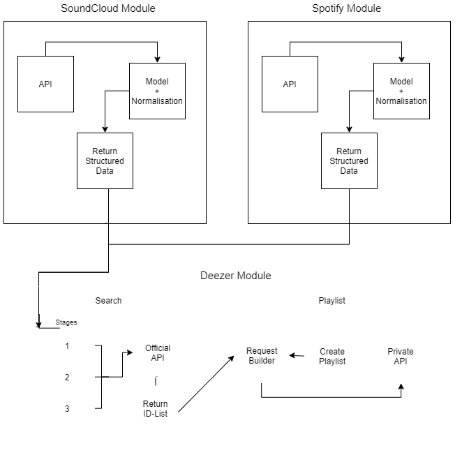

# DeezerSync
Application to Sync Playlists to Deezer

## Supported Platforms
+ SoundCloud
+ Spotify (later on)

## Supported Operating Systems
+ Windows
+ macOS
+ Linux

## Used Libraries
+ [Newtonsoft.Json](https://github.com/JamesNK/Newtonsoft.Json)
+ [SoundCloud.Api](https://github.com/prayzzz/SoundCloud.Api)
+ [NLog](https://github.com/NLog/NLog)

### Build with dotNET Core 3 & VS 2019

## Getting Started
To run this Program a `config.json` config file is needed in the working directory.
The `config.json` requires the following entries:

```console
{
  "SoundCloud_Username": "",    // SoundCloud User Name (These are the playlists to sync)
  "SoundCloud_ClientID": "",	// SoundCloud ClientID (leave empty for automatic setup)
  "Deezer_Secret": ""           // Login to Deezer and search in the dev console for an arl Cookie
}
```

## Application Architecture



## DeezerSync
__Is the entrypoint CLI Application__

## DeezerSync.DeezerAPI
__API Client for Public and Private Deezer API__

## DeezerSync.Core
__Contains all Data Models for Objects, Data manipulation and compare logic__

## DeezerSync.MusicProvider
__Contains logic for all Music Providers (SoundCloud, Spotify, ...) and an interface to cast all data to a standard object.__

## DeezerSync.Test
__Contains all xUnit Test for the whole Project.__