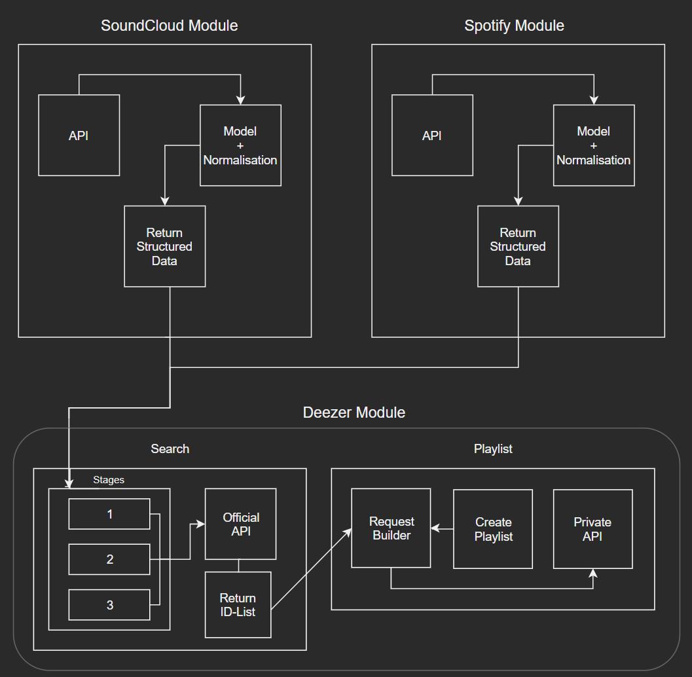

# DeezerSync
Application to Sync Playlists to Deezer

## Supported Platforms
+ SoundCloud
+ Spotify

## Supported Operating Systems
+ Windows
+ Linux (x86 & arm)
+ macOS

## Used Libraries
+ [Newtonsoft.Json](https://github.com/JamesNK/Newtonsoft.Json)
+ [SoundCloud.Api](https://github.com/prayzzz/SoundCloud.Api)
+ [NLog](https://github.com/NLog/NLog)
+ [SpotifyAPI-NET](https://github.com/JohnnyCrazy/SpotifyAPI-NET)

### Build with dotNET Core 3 & VS 2019

## Getting Started
To run this Program a `config.json` config file is needed in the working directory.
The `config.json` requires the following entries:

```console
{
  "SoundCloud_Username": "",    // SoundCloud User Name (These are the playlists to sync)
  "SoundCloud_ClientID": "",	  // SoundCloud ClientID (leave empty for automatic setup)
  "Deezer_Secret": "",          // Login to Deezer and search in the dev console for an arl Cookie
  "Spotify_Username" : "",      // Spotify User Name (These are the playlists to sync)
  "Spotify_Secret" : ""         // Spotify Bearer API Key
}
```

## Application Architecture


## The Staging System

The Deezer Search is build up in three stages.
Every stage is a indipendent search query you have to get an empty result in order to jump through the stages.

1. Prepare search query remove unsearchable chars such as (`&`  `<`  `>`  `(`  `)`  `[`  `]`) and detect if the song is a remix and save the remix artist as an extra artist

1. Artist changes, split song title at first `-` char and replace it with the possible remix artist or with the SoundCloud user name.

1. Search only with song name (without the artist name) and duration

## DeezerSync
__Is the entrypoint CLI Application__

## DeezerSync.DeezerAPI
__API Client for Public and Private Deezer API__

## DeezerSync.Core
__Contains all Data Models for Objects, Data manipulation and compare logic__

## DeezerSync.MusicProvider
__Contains logic for all Music Providers (SoundCloud, Spotify, ...) and an interface to cast all data to a standard object.__

## DeezerSync.Test
__Contains all xUnit Test for the whole Project.__
